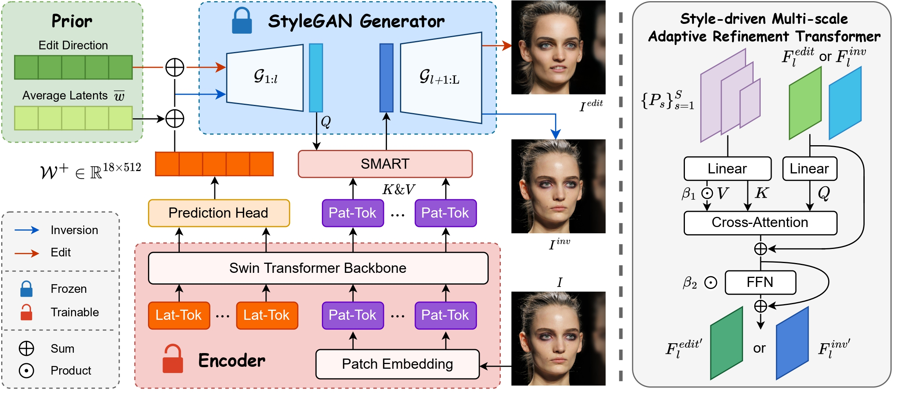
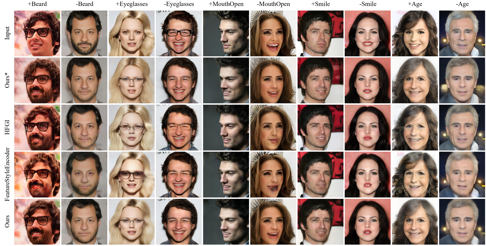

# StylePrompter: All Styles Need Is Attention

> **StylePrompter: All Styles Need Is Attention** 
> Chenyi Zhuang, Pan Gao*, Aljosa Smolic  
> https://arxiv.org/abs/2307.16151  
>
> **Abstract:** GAN inversion aims at inverting given images into corresponding latent codes for Generative Adversarial Networks (GANs), especially StyleGAN where exists a disentangled latent space that allows attribute-based image manipulation. As most inversion methods build upon Convolutional Neural Networks (CNNs), we transfer a hierarchical vision Transformer backbone innovatively to predict $\mathcal{W^+}$ latent codes at token level. We further apply a Style-driven Multi-scale Adaptive Refinement Transformer (SMART) in $\mathcal{F}$ space to refine the intermediate style features of the generator. By treating style features as queries to retrieve lost identity information from the encoder's feature maps, SMART can not only produce high-quality inverted images but also surprisingly adapt to editing tasks. We then prove that StylePrompter lies in a more disentangled $\mathcal{W^+}$ and show the controllability of SMART. Finally, quantitative and qualitative experiments demonstrate that StylePrompter can achieve desirable performance in balancing reconstruction quality and editability, and is "smart" enough to fit into most edits, outperforming other $\mathcal{F}$-involved inversion methods.

## Description
This repository is the official PyTorch implementation of *StylePrompter: All Styles Need Is Attention*.

Our method embeds latent codes as tokens into the Swin Transformer encoder, and refines the style features via SMART block to achieve high-quality inverted images.

## Usage

### Training Baseline

- The main training script is placed in `./scripts/train.py`.
- Training arguments can be found at `./options/train_options.py`. Please set ***type*** as ***baseline*** to train the encoder.

- Simply for Linux, run the bash scripts placed in `./run_bash/train_ffhq_base.sh`.

### Training SMART

- The main training script is placed in `./scripts/train.py`.
- Training arguments can be found at `./options/train_options.py`. Please set ***type*** as ***full*** to train the encoder.

- Simply for Linux, run the bash scripts placed in `./run_bash/train_ffhq_full.sh`.

* To train SMART, you must have trained the baseline or downloaded the weight file of the base model.

### Inference

- For images in folder, run the inference script placed in `./scripts/inference.py`. Inference arguments can be found at `./options/test_options.py`.
- For single image, run the inference script placed in `./scripts/inference_single.py` and define the image path.

### Style Mixing

- We propose to manipulate images through three kinds of style mixing: *progressively replacing*, *one-layer exchanging* and *interpolation*, for which the script is placed in `./scripts/style_mixing.py`.
- Define paths to the reference image and target image, then run the script to enjoy the interesting results.

### Pre-trained Models

### Pretrained Models
Please download the pre-trained models from the following links and save to `./pretrained`. 

| Path | Description
| :--- | :----------
|[FFHQ baseline](https://drive.google.com/drive/folders/1yMgxxQvqW0QNPx1QV_uXicPc_i8hIHin) | StylePrompter encoder for FFHQ.
|[FFHQ full](https://drive.google.com/drive/folders/19eyQIkN9mYc40T19d9SKCBtUtracz9_s) | StylePrompter full model (with SMART) for FFHQ.

In addition, auxiliary models needed for training your own model are as follows.

| Path | Description
| :--- | :----------
|[FFHQ StyleGAN](https://drive.google.com/file/d/1EM87UquaoQmk17Q8d5kYIAHqu0dkYqdT/view?usp=sharing) | StyleGAN model pretrained on FFHQ taken from [rosinality](https://github.com/rosinality/stylegan2-pytorch) with 1024x1024 output resolution.
|[IR-SE50 Model](https://drive.google.com/file/d/1KW7bjndL3QG3sxBbZxreGHigcCCpsDgn/view?usp=sharing) | Pretrained IR-SE50 model taken from [TreB1eN](https://github.com/TreB1eN/InsightFace_Pytorch) for use in our ID loss during training.
|[MOCOv2 Model](https://drive.google.com/file/d/18rLcNGdteX5LwT7sv_F7HWr12HpVEzVe/view?usp=sharing) | Pretrained ResNet-50 model trained using MOCOv2 for use in our simmilarity loss for domains other then human faces during training.
| [SwinV2 Model](https://github.com/microsoft/Swin-Transformer/blob/main/configs/swinv2/swinv2_tiny_patch4_window16_256.yaml) | Pretrained Swin v2 model in tiny size for our encoder's initialization.

## Examples

### Inference

### Editing

## Acknowledgments
The StyleGAN2 codes are taken from [rosinality/stylegan2-pytorch](https://github.com/rosinality/stylegan2-pytorch). 

The editing directions we used for editing are taken from [RameenAbdal/CLIP2StyleGAN](https://github.com/RameenAbdal/CLIP2StyleGAN/tree/main) and [orpatashnik/StyleCLIP](https://github.com/orpatashnik/StyleCLIP).